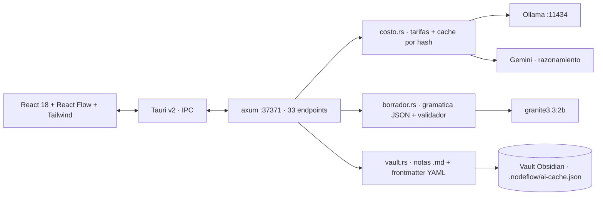

# NodeFlow

**Orquestador de inferencia híbrida Edge/Cloud para grafos de conocimiento.**
App nativa de escritorio (Tauri v2 + Rust) que convierte ideas dispersas en un grafo de conocimiento estructurado y versionado — decidiendo *por tarea* si la inferencia corre **local** (privada, sin cuota, instantánea) o en la **nube** (razonamiento profundo), y contabilizando el costo de cada llamada.

> Versión en inglés (principal, para la hackathon): [`README.md`](README.md)

## El problema

1. **Todo va a la nube.** Resumir una nota o extraer entidades no necesita un modelo frontera remoto: necesita uno que ya está instalado. Enviarlo afuera cuesta, agrega latencia y expone notas privadas.
2. **Nada se contabiliza.** El costo por artefacto es invisible: nadie sabe qué operaciones vale la pena pagar.
3. **Nada se reutiliza.** El mismo prompt sobre el mismo nodo se recalcula siempre.

## Por qué es infraestructura, no una app de notas

| Eje | Qué hace NodeFlow |
|---|---|
| **Cómputo edge** | Modelo local (`Ollama`, `granite3.3:2b`) redacta títulos, categorías y tags: sin cuota, sin internet, las notas nunca salen de la máquina. |
| **Cómputo nube** | El razonamiento complejo sobre varias ramas del grafo se delega a un endpoint en la nube (Gemini hoy; cualquier endpoint compatible con OpenAI encaja). |
| **Costo y reuso** | Cada llamada se tarifa por proveedor (`costo.rs`) y se cachea por hash de *nodo + prompt + proveedor*, con contrato versionado. |
| **Eficiencia de recursos** | Shell nativo en Rust: **28,6 MB de RAM** medidos sobre el binario de release (un equivalente en Electron ronda 10-20× eso), dejando la GPU libre para la inferencia local. |
| **Determinismo** | El modelo propone, el código valida: cada salida estructurada se verifica campo por campo antes de tocar el grafo. |

## Arquitectura



## Números medidos

Medidos en esta máquina, no estimados.

| Métrica | Valor |
|---|---|
| Memoria residente del binario nativo | **39,8 MB** (`Get-Process app` sobre el release en ejecución) |
| Inferencia evitada por la caché | **40.567 tokens** (22.216 exactos + 18.351 semánticos) · 173 entradas · 13 aciertos de 305 llamadas |
| Tests Rust | **272 passed / 0 failed** (`cargo test --lib`) |
| Rutas HTTP | **79** |
| Grafo en uso diario | 65 nodos · 99 aristas |
| Voz local descargada bajo demanda | **405 MB en 75 s** · 4,16 s de audio en **1.706 ms (2,4× tiempo real)**, en una máquina sin Python instalado |
| Métrica de valor (idea cruda → artefacto aprobado) | **15 conversiones · 24,7 min** de promedio (el objetivo declarado es 3 min) |
| Líneas propias | ~48.900 (TS/TSX 21,8k · Rust 24,2k · MCP 1,3k · scripts 1,0k · demo 0,7k) |
| Instalador (v0.3.6) | **4,7 MB** NSIS · **7,1 MB** MSI (la voz es opcional y se descarga, no viaja adentro) |

## Qué funciona hoy

Canvas de nodos y aristas (React Flow) con auto-organización, lentes por categoría y zonas · borradores locales validados por código · contabilidad de costo y caché por artefacto · corridas de experto sobre nodo o selección · diagnóstico y reparación del grafo (jardín) · integración con Obsidian (Markdown + frontmatter) · human-in-the-loop: el agente **propone** y el cambio se aplica con aprobación explícita · **voz que opera el lienzo** (crear, enlazar, enfocar, condensar, criticar, delegar, responder, aceptar, descartar) con modo conversación, cuyo guion de pasos guiados es local y cuesta 0 tokens · **voz local (Kokoro) descargable desde la app**, con verificación de SHA-256 y arranque automático (sin ella habla la voz del sistema) · **servidor MCP empaquetado** en el instalador e instalable desde el panel del agente · ciclo de preguntas, decisiones, evidencia y retomar.

## Qué falta (honesto)

Streaming (SSE) hacia el nodo activo · interruptor visible Local/Cloud por tarea · builds para macOS/Linux · certificado Authenticode (la firma del updater y la actualización automática **ya funcionan**) · el resto de la traducción (~254 textos de modales secundarios) · y la métrica de valor: 24,7 min contra los 3 min que declara el dossier.

## Inicio rápido

Requisitos: Windows 10/11 x64, WebView2, Node.js 22+, Rust 1.77+, `Ollama` para inferencia local.

```bash
npm install
ollama pull granite3.3:2b     # modelo de borradores local
npm run dev:web               # Vite (:5173)
npx tauri dev                 # app completa: backend Rust + ventana nativa
npx tauri build               # binario de release + instaladores MSI y NSIS
cargo test --manifest-path src-tauri/Cargo.toml --lib   # 60 tests
```

## Principios de diseño

1. **El modelo propone, el código valida** (una gramática garantiza la forma, no la verdad).
2. **La clave de caché no puede llevar el reloj** (con `now_iso()` se medían 6 fallos / 0 aciertos en corridas idénticas).
3. **Medir, no suponer**: contrastes, memoria, aciertos de caché y rechazos del validador se midieron; varias decisiones cambiaron cuando la medición contradijo el supuesto.

## Licencia

MIT. Hecho por **TOMAS.WAV** (Tomas Pieruz).
