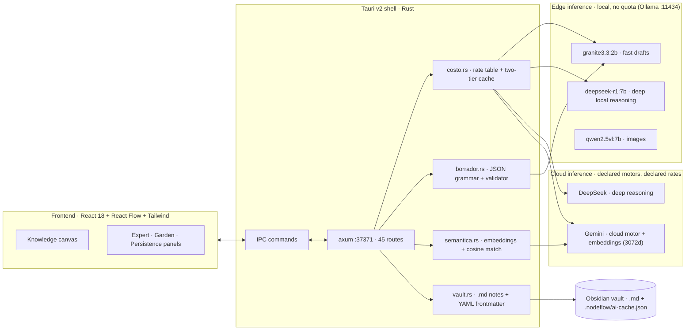

# NodeFlow

**A hybrid Edge/Cloud inference orchestrator for knowledge graphs.**
Native desktop app (Tauri v2 + Rust) that turns scattered ideas into a structured, versioned knowledge graph — deciding *per task* whether inference runs **locally** (private, zero-cost, instant) or in the **cloud** (deeper reasoning), and accounting for the cost of every call.

<p>


</p>

---

## The problem

Knowledge workers already run AI on their machines, but the current stack wastes resources in three ways:

1. **Everything goes to the cloud.** Summarising a note, extracting entities or parsing Markdown do not need a remote frontier model — they need a model that is already installed. Sending them out costs money, adds latency, and leaks private notes.
2. **Nothing is accounted for.** Per-artifact inference cost is invisible, so nobody can tell which operations are worth paying for.
3. **Nothing is reused.** The same prompt against the same node content is recomputed every single time.

NodeFlow is a desktop client + local server that fixes those three things, and a visual canvas where the resulting knowledge is organised.

## Why this is infrastructure, not a note app

| Axis | What NodeFlow does |
|---|---|
| **Edge compute** | Local models through Ollama: `granite3.3:2b` drafts titles, categories and tags, `deepseek-r1:7b` takes the deep local reasoning, `qwen2.5vl:7b` reads images — no quota, works offline, notes never leave the machine. |
| **Cloud compute** | When a task needs more depth, the router escalates to a **declared** cloud motor: **DeepSeek** (`deepseek-chat` / `deepseek-reasoner`) or **Gemini** (`gemini-3.6-flash`). Any OpenAI-compatible endpoint fits — the motor list and its rates live in config, not in code. |
| **Cost & reuse** | Every call is priced per provider (`costo.rs`; rates come from config, and **a model without a declared rate reports "unknown cost", never a fake `$0`**) and cached in **two tiers**: exact key (node + prompt + provider + schema + `CACHE_VER`) and **semantic** (cosine over Gemini embeddings, threshold 0.92, with a dependency-free normalised-token fallback when there is no key or no network). |
| **Resource efficiency** | Native Rust shell: **38.9 MB RSS** measured on the running release binary (Electron-based equivalents idle well above that), leaving the GPU free for local inference. |
| **Determinism** | The model proposes, the code validates: every structured output is checked field by field before it touches the graph. |

## Architecture



## Measured numbers

All figures below were measured on this machine, not estimated.

| Metric | Value | How it was measured |
|---|---|---|
| Resident memory of the native shell | **38.9 MB RSS** | `Get-Process app` on the running v0.3.4 release build (Sep 15 2026) |
| Inference avoided by the cache | **10,043 tokens** (3,488 exact + 6,555 semantic) | `GET /api/ai/cache` — 80 entries, 2 hits, 2 semantic hits, cap 300 |
| Knowledge graph in daily use | **55 nodes · 85 edges** | `GET /api/graph/state` |
| Brain dump → approved AI artifact (T0→T1) | **5 conversions, median 24.7 min** (3.8 · 24.7 · 24.8 · 61.6) | `GET /api/metrics` — timestamps recorded by the app itself |
| Engine planilla, both motors on the same 5 real tasks | **`deepseek-r1:7b` 4/5 · `granite3.3:2b` 3/5** | [`docs/EVALUACION.md`](docs/EVALUACION.md) |
| Local draft latency | 5.1 s cold · **0.7 s warm** (`keep_alive: 5m`) | `POST /api/knowledge/draft` (v0.1.0 measurement) |
| Rust unit tests | **140 passed / 0 failed** | `cargo test --lib` on the v0.3.4 tree (Sep 15 2026) |
| Own source lines | **~31,250** (TS/TSX ~17.0k · Rust ~13.4k · Python 950) | `find` + `wc -l` over `src/`, `src-tauri/src/`, `mcp-server/` |

## What works today

- **Canvas** — knowledge graph on React Flow: create/edit node cards, typed edges, auto-organisation by level, category lenses, zones, LOD by zoom.
- **Condensation engine (lossless pruning)** — define a *strategic north star* and collapse a whole selection into one macro-node: its nodes and edges are kept inside as lineage (`collapsed_nodes_count`, `lineage_node_ids`), so **nothing is lost** — double-click a macro-node to see where it came from and restore the original sub-graph.
- **Local drafts** — `granite3.3:2b` proposes title/category/tags for raw captures; a Rust validator accepts or rejects each field against the *live* category vocabulary of the graph.
- **Cost accounting and caching** — trace of tokens + USD cost per generated artifact; a **two-tier cache** (exact key with a versioned contract, plus a semantic tier that matches by meaning) and eviction. Measured in normal use: **10,043 tokens of inference avoided** (3,488 by the exact tier, 6,555 by the semantic one).
- **T0→T1 metric** — the app times its own value: from the raw brain dump to the first AI proposal *approved* by a human. Current graph: **5 conversions, median 24.7 minutes** (`GET /api/metrics`).
- **Expert runs** — a reusable prompt contract produces validated artifacts (visual prompts, synthesis) from a node or a multi-node selection.
- **Graph hygiene** — garden diagnostics: dangling edges, orphans, duplicates, repair and tidy.
- **Voice → operations (Speechmatics)** — talk and the canvas acts: the transcript is interpreted as a *plan* of operations (create nodes, link them to what already exists, focus the canvas on one idea and collapse the rest, question a set of nodes). The plan is **validated server-side against the real graph** — only existing ids, only allowed actions, hard caps — and shown for approval before anything is touched. Realtime ASR latency, tokens and cost are measured per dictation.
- **Vault integration** — notes live as Markdown + YAML frontmatter in an Obsidian vault; the graph and the vault are the same knowledge, in two views.
- **Human in the loop** — the agent (local or remote) never writes to the graph directly: it *proposes*, and the change is applied after explicit approval, with an audit trail.

## Not built yet

Honest list, in priority order: **streaming responses (SSE) into the active node** — today a node
appears when the JSON of the whole phase closes, so local runs show 6-8 s of narrated wait; a visible
**per-task Local/Cloud switch on the canvas** (the router already accepts a per-task override and
`motor_activo` drives it from config, but the control is not surfaced next to the node);
**macOS/Linux builds**; and **OS code-signed installers** — the Tauri updater signature and the
auto-update channel already work (releases since v0.3.1), what is missing is the Authenticode
certificate.

## Quick start

**Requirements:** Windows 10/11 x64, WebView2 runtime, Node.js 22+, Rust 1.77+, and `Ollama` for local inference.

```bash
npm install                 # frontend deps
ollama pull granite3.3:2b   # local drafting model (optional but recommended)

npm run dev:web             # Vite dev server (frontend only, :5173)
npx tauri dev               # full app: Rust backend + native window

npx tauri build             # release binary + MSI + NSIS installers
cargo test --manifest-path src-tauri/Cargo.toml --lib   # 60 unit tests
```

The backend listens on `127.0.0.1:37371`; `GET /api/health` reports readiness. The knowledge vault is a folder of Markdown notes (point the app at your Obsidian vault); the app keeps its own state under `<vault>/.nodeflow/`.

## Configuration

Copy `.env.example` to `.env` and fill in what you use. **API keys are never committed** — `.env`, `*.key` and local data folders are git-ignored, and keys entered in the app are stored in the local app data directory.

```
GEMINI_API_KEY=""        # cloud reasoning (optional: the app runs fully local without it)
OLLAMA_HOST=http://localhost:11434
```

## API surface (33 endpoints)

| Group | Endpoints |
|---|---|
| Graph | `/api/graph/state` · `node` · `node/delete` · `edge` · `summary` · `garden` · `garden/fix` · `tidy` · `prune` |
| AI | `/api/ai/action` · `/api/ai/cache` · `/api/expert/run` · `/api/expertos` |
| Knowledge | `/api/knowledge/capture` · `draft` · `preview` |
| Vault | `/api/vault/info` · `search` · `note` · `memory` · `reindex` |
| Agent (HITL) | `/api/agent/pending` · `approve` · `reject` |
| Calibration | `/api/hitl/feedback` · `preferences` · `profile` · `recalibrate` · `reset` |
| Export / misc | `/api/export/json` · `export/document` · `/api/metrics` · `/api/health` |

## Business value

The waste NodeFlow attacks is measurable and it sits on every knowledge worker's machine: reasoning
that never needed a frontier model, inference nobody accounts for, and results that get recomputed.

- **Where it fits.** Any team whose notes, specs or research are private by nature — product and
  research teams, agencies under NDA, legal/health/finance knowledge work — and any shop paying per
  token for work a local 2B model can already do. The router decides *per task*; the cost log shows
  what each artifact actually cost.
- **What it replaces.** A chat window that starts from zero every time. NodeFlow keeps a versioned,
  human-approved graph in a folder of Markdown the customer already owns (Obsidian): the knowledge
  survives the tool, with no proprietary database and no lock-in.
- **Why it pays.** The operations that leak private notes to a cloud API today run locally at zero
  marginal cost; the expensive calls are the ones you chose, and every one of them is logged with
  tokens and USD.
- **Path from hackathon to product.** The desktop app is already published with a working updater, so
  the distribution channel exists today. Near-term revenue is service work built on it (agent
  automation, private-knowledge workflows) with the app as the lead magnet; the longer-term path is a
  paid tier around team sync, the approval audit trail and per-artifact cost governance.
- **Proof it works in daily use** (read off the app itself): **5 brain dump → approved-artifact
  conversions**, median **24.7 minutes**, and **10,043 tokens of inference avoided** by the cache.

## What is genuinely new here

Five mechanisms that are not the usual "LLM wrapped around a notes app":

1. **The model proposes, the code validates — against the live vocabulary of the graph.** A JSON
   grammar only guarantees the *shape* of an answer: the local 2B once returned `madurez: 100` in
   perfectly valid JSON. Every structured field is therefore checked against what the graph actually
   contains, and a draft is rejected field by field (`borrador.rs`, `conocimiento.rs`).
2. **A cache whose key cannot drift.** Same node + prompt + provider + schema + `CACHE_VER`, with a
   semantic tier on top (cosine ≥ 0.92) that degrades to a dependency-free token comparison when
   there is no key or no network. The first implementation hashed a prompt containing `now_iso()` and
   scored 6 misses / 0 hits on identical runs; the key is now a versioned contract with tests.
3. **Every action is a proposal with an audit trail.** The agent — local or cloud — never writes to
   the graph: it proposes, the change is validated against real ids and hard caps, and it lands only
   after explicit human approval. That is the difference between an assistant and an autonomous writer.
4. **Lossless condensation with lineage.** A selection collapses into one macro-node that *keeps* the
   nodes and edges inside it (`collapsed_nodes_count`, `lineage_node_ids`); double-click restores the
   original sub-graph. Pruning that cannot lose anything.
5. **The spoken loop decides when to talk in code, not vibes.** `voz::debe_hablar()` in Rust (with
   tests) rules on whether the assistant speaks: structural moves and discarded proposals are spoken,
   creating or linking nodes stays silent because you can see it.

## Design principles

1. **The model proposes, the code validates.** A JSON grammar guarantees the *shape* of an answer, never its *truth*: the local model once returned `madurez: 100` in perfectly valid JSON. Every structured field is therefore checked against live graph vocabulary before use.
2. **A cache key must not carry the clock.** The first cache implementation hashed a prompt containing `now_iso()` and scored 6 misses / 0 hits on identical runs. The key now carries the day plus a fingerprint of the facts.
3. **Measure, don't assume.** Contrast ratios, memory footprint, cache hit rates and validator rejections in this repo were all measured; several design decisions changed after the measurement contradicted the assumption.

## The spoken loop (local voice)

Talk, the canvas acts, and the assistant answers **out loud only when it has something to say**:
structural moves (focus, condense, question) and discarded proposals are spoken; creating or linking
nodes stays silent because you can see it.

- **Ears:** Speechmatics Realtime (websocket, sub-second partials).
- **Voice:** **Kokoro TTS locally** — 82M parameters, ~340 MB, no torch, no quotas, no text leaving the
  machine (`tools/tts/`). Measured on this machine: **2.4× faster than real time**.
- **The rule that decides whether it speaks** is code, not vibes: `voz::debe_hablar()` in Rust, with tests.
- Start the voice server with `tools/tts/arrancar-oculto.vbs` (windowless) — the app detects it and keeps
  working if it's not running.

## Documentation

- [`docs/BENCHMARKS.md`](docs/BENCHMARKS.md) — the measured numbers: hardware, local model throughput (prefill/decode), the engine planilla and the cache effect.
- [`ROADMAP.md`](ROADMAP.md) — phases and next milestones.
- [`docs/FLUJO.md`](docs/FLUJO.md) — workflow: verified auto-save checkpoints, devlog generated from the git history, versioned releases and backups.
- Auto-save runs **in the background and windowless**, every 10 minutes (Windows scheduled task →
  `scripts/auto-oculto.vbs`), and checks only what changed: TypeScript for `.ts/.tsx`, Rust tests for
  `.rs/.toml`, nothing for docs-only edits.
- [`docs/DEVLOG.md`](docs/DEVLOG.md) — development log, generated from the commit history.
- [`docs/adr/`](docs/adr) — Architecture Decision Records (why Tauri over Electron, why a hash cache, why code-side validation, why hybrid routing).

Commits follow [Conventional Commits](https://www.conventionalcommits.org/) and versions follow SemVer.

## License

MIT — see [`LICENSE`](LICENSE). Built by **TOMAS.WAV** (Tomas Pieruz).
