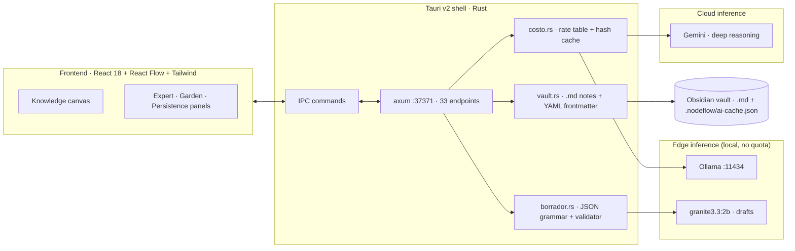

# NodeFlow

**A hybrid Edge/Cloud inference orchestrator for knowledge graphs.**
Native desktop app (Tauri v2 + Rust) that turns scattered ideas into a structured, versioned knowledge graph — deciding *per task* whether inference runs **locally** (private, zero-cost, instant) or in the **cloud** (deeper reasoning), and accounting for the cost of every call.

<p>


</p>

---

## The problem

Knowledge workers already run AI on their machines, but the current stack wastes resources in three ways:

1. **Everything goes to the cloud.** Summarising a note, extracting entities or parsing Markdown do not need a remote frontier model — they need a model that is already installed. Sending them out costs money, adds latency, and leaks private notes.
2. **Nothing is accounted for.** Per-artifact inference cost is invisible, so nobody can tell which operations are worth paying for.
3. **Nothing is reused.** The same prompt against the same node content is recomputed every single time.

NodeFlow is a desktop client + local server that fixes those three things, and a visual canvas where the resulting knowledge is organised.

## Why this is infrastructure, not a note app

| Axis | What NodeFlow does |
|---|---|
| **Edge compute** | Local model (`Ollama`, `granite3.3:2b`) drafts titles, categories and tags — no quota, works offline, notes never leave the machine. |
| **Cloud compute** | Complex reasoning across several branches of the graph is delegated to a cloud endpoint (Gemini today; any OpenAI-compatible endpoint fits). |
| **Cost & reuse** | Every call is priced per provider (`costo.rs`) and cached by hash of *node + prompt + provider*, with a versioned contract. |
| **Resource efficiency** | Native Rust shell: **28.6 MB RAM** measured on the running release binary (Electron-based equivalents idles at 10-20x that), leaving the GPU free for local inference. |
| **Determinism** | The model proposes, the code validates: every structured output is checked field by field before it touches the graph. |

## Architecture



## Measured numbers

All figures below were measured on this machine, not estimated.

| Metric | Value | How it was measured |
|---|---|---|
| Resident memory of the native binary | **28.6 MB** | `tasklist` on the running release build |
| Repeat inference (identical node + prompt) | **27.9 s / 9,061 tokens → 0.4 s / 0 tokens** | two consecutive runs of the same expert |
| Tokens avoided by the cache | **23,893** across 17 cached entries | `GET /api/ai/cache` |
| Local draft latency | 5.1 s cold · **0.7 s warm** (`keep_alive: 5m`) | `POST /api/knowledge/draft` |
| Rust unit tests | **60 passed / 0 failed** | `cargo test --lib` |
| Knowledge graph in daily use | 54 nodes · 68 edges · 0 dangling | `GET /api/graph/garden` |
| Own source lines | 23,860 (TSX 9,931 · Rust 8,583 · TS 4,110 · Python 950 · CSS 286) | `wc -l` over `src/`, `src-tauri/src/`, `mcp-server/` |

## What works today

- **Canvas** — knowledge graph on React Flow: create/edit node cards, typed edges, auto-organisation by level, category lenses, zones, LOD by zoom.
- **Local drafts** — `granite3.3:2b` proposes title/category/tags for raw captures; a Rust validator accepts or rejects each field against the *live* category vocabulary of the graph.
- **Cost accounting and caching** — trace of tokens + USD cost per generated artifact; hash cache with a versioned contract and eviction.
- **Expert runs** — a reusable prompt contract produces validated artifacts (visual prompts, synthesis) from a node or a multi-node selection.
- **Graph hygiene** — garden diagnostics: dangling edges, orphans, duplicates, repair and tidy.
- **Vault integration** — notes live as Markdown + YAML frontmatter in an Obsidian vault; the graph and the vault are the same knowledge, in two views.
- **Human in the loop** — the agent (local or remote) never writes to the graph directly: it *proposes*, and the change is applied after explicit approval, with an audit trail.

## Not built yet

Honest list, in priority order: streaming responses (SSE) into the active node; a visible per-task Local/Cloud switch in the UI; platform builds for macOS/Linux; code-signed installers and an updater; voice input.

## Quick start

**Requirements:** Windows 10/11 x64, WebView2 runtime, Node.js 22+, Rust 1.77+, and `Ollama` for local inference.

```bash
npm install                 # frontend deps
ollama pull granite3.3:2b   # local drafting model (optional but recommended)

npm run dev:web             # Vite dev server (frontend only, :5173)
npx tauri dev               # full app: Rust backend + native window

npx tauri build             # release binary + MSI + NSIS installers
cargo test --manifest-path src-tauri/Cargo.toml --lib   # 60 unit tests
```

The backend listens on `127.0.0.1:37371`; `GET /api/health` reports readiness. The knowledge vault is a folder of Markdown notes (point the app at your Obsidian vault); the app keeps its own state under `<vault>/.nodeflow/`.

## Configuration

Copy `.env.example` to `.env` and fill in what you use. **API keys are never committed** — `.env`, `*.key` and local data folders are git-ignored, and keys entered in the app are stored in the local app data directory.

```
GEMINI_API_KEY=""        # cloud reasoning (optional: the app runs fully local without it)
OLLAMA_HOST=http://localhost:11434
```

## API surface (33 endpoints)

| Group | Endpoints |
|---|---|
| Graph | `/api/graph/state` · `node` · `node/delete` · `edge` · `summary` · `garden` · `garden/fix` · `tidy` · `prune` |
| AI | `/api/ai/action` · `/api/ai/cache` · `/api/expert/run` · `/api/expertos` |
| Knowledge | `/api/knowledge/capture` · `draft` · `preview` |
| Vault | `/api/vault/info` · `search` · `note` · `memory` · `reindex` |
| Agent (HITL) | `/api/agent/pending` · `approve` · `reject` |
| Calibration | `/api/hitl/feedback` · `preferences` · `profile` · `recalibrate` · `reset` |
| Export / misc | `/api/export/json` · `export/document` · `/api/metrics` · `/api/health` |

## Design principles

1. **The model proposes, the code validates.** A JSON grammar guarantees the *shape* of an answer, never its *truth*: the local model once returned `madurez: 100` in perfectly valid JSON. Every structured field is therefore checked against live graph vocabulary before use.
2. **A cache key must not carry the clock.** The first cache implementation hashed a prompt containing `now_iso()` and scored 6 misses / 0 hits on identical runs. The key now carries the day plus a fingerprint of the facts.
3. **Measure, don't assume.** Contrast ratios, memory footprint, cache hit rates and validator rejections in this repo were all measured; several design decisions changed after the measurement contradicted the assumption.

## Documentation

- [`ROADMAP.md`](ROADMAP.md) — phases and next milestones.
- [`docs/FLUJO.md`](docs/FLUJO.md) — workflow: verified auto-save checkpoints, devlog generated from the git history, versioned releases and backups.
- [`docs/DEVLOG.md`](docs/DEVLOG.md) — development log, generated from the commit history.
- [`docs/adr/`](docs/adr) — Architecture Decision Records (why Tauri over Electron, why a hash cache, why code-side validation, why hybrid routing).

Commits follow [Conventional Commits](https://www.conventionalcommits.org/) and versions follow SemVer.

## License

MIT — see [`LICENSE`](LICENSE). Built by **TOMAS.WAV** (Tomas Pieruz).
