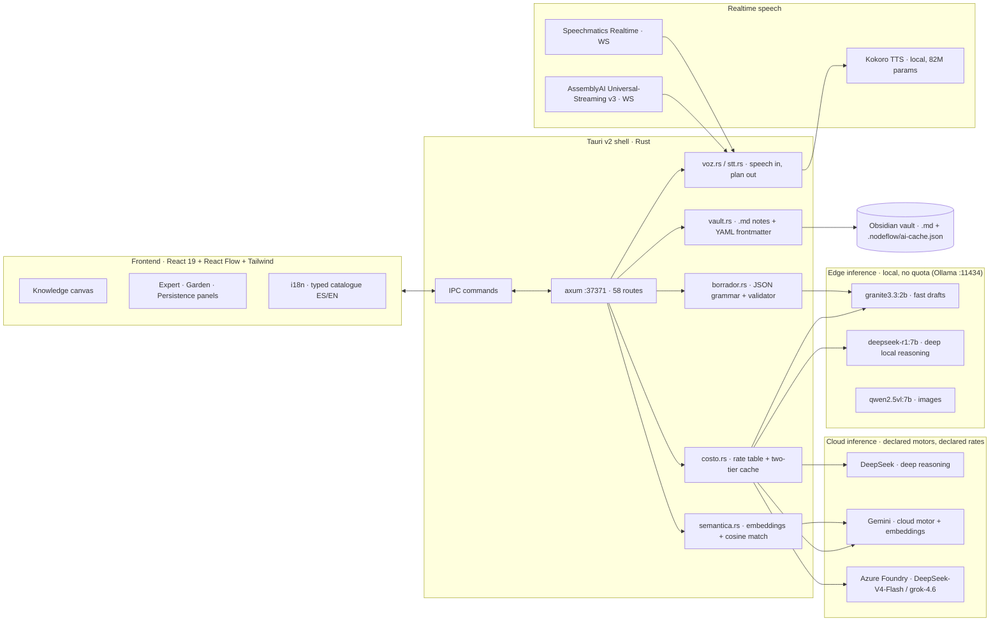

# NodeFlow

**A hybrid Edge/Cloud inference orchestrator for knowledge graphs.**
Native desktop app (Tauri v2 + Rust) that turns scattered ideas into a structured, versioned knowledge graph — deciding *per task* whether inference runs **locally** (private, zero-cost, instant) or in the **cloud** (deeper reasoning), and accounting for the cost of every call.

<p>


</p>

**Try it without installing anything: [nodeflow-demo.vercel.app](https://nodeflow-demo.vercel.app)** — the same frontend against a simulated API, with the real AssemblyAI voice path running from the browser (talk in Spanish, get a validated plan over the canvas).

---

## The problem

Knowledge workers already run AI on their machines, but the current stack wastes resources in three ways:

1. **Everything goes to the cloud.** Summarising a note, extracting entities or parsing Markdown do not need a remote frontier model — they need a model that is already installed. Sending them out costs money, adds latency, and leaks private notes.
2. **Nothing is accounted for.** Per-artifact inference cost is invisible, so nobody can tell which operations are worth paying for.
3. **Nothing is reused.** The same prompt against the same node content is recomputed every single time.

NodeFlow is a desktop client + local server that fixes those three things, and a visual canvas where the resulting knowledge is organised.

## Why this is infrastructure, not a note app

| Axis | What NodeFlow does |
|---|---|
| **Edge compute** | Local models through Ollama: `granite3.3:2b` drafts titles, categories and tags, `deepseek-r1:7b` takes the deep local reasoning, `qwen2.5vl:7b` reads images — no quota, works offline, notes never leave the machine. |
| **Cloud compute** | When a task needs more depth, the router escalates to a **declared** cloud motor: **DeepSeek** (`deepseek-chat` / `deepseek-reasoner`), **Gemini** (`gemini-3.6-flash`) or **Azure AI Foundry** (`DeepSeek-V4-Flash`, `grok-4.6`, `gpt-5-mini`, `text-embedding-3-small`). Any OpenAI-compatible endpoint fits — the motor list and its rates live in config, not in code. |
| **Cost & reuse** | Every call is priced per provider (`costo.rs`; rates come from config, and **a model without a declared rate reports "unknown cost", never a fake `$0`**) and cached in **two tiers**: exact key (node + prompt + provider + schema + `CACHE_VER`) and **semantic** (cosine over embeddings, threshold 0.92, with a dependency-free normalised-token fallback when there is no key or no network). |
| **Resource efficiency** | Native Rust shell: **37.7 MB RSS** measured on the running release binary (Electron-based equivalents idle well above that), leaving the GPU free for local inference. |
| **Determinism** | The model proposes, the code validates: every structured output is checked field by field before it touches the graph. |
| **Two languages, one switch** | The interface is English/Spanish from a **typed catalogue**: a missing translation is a compile error, and the language travels with the voice (the spoken loop answers with a native voice in the language you set). |

## Architecture



## Measured numbers

All figures below were measured on this machine, not estimated.

| Metric | Value | How it was measured |
|---|---|---|
| Resident memory of the native shell | **37.7 MB RSS** | `Get-Process app` on the running v0.3.5 release build (Sep 16 2026) |
| Inference avoided by the cache | **32,382 tokens** (14,031 exact + 18,351 semantic) | `GET /api/ai/cache` — 112 entries, 5 exact hits, 5 semantic hits, cap 300 |
| Knowledge graph in daily use | **57 nodes · 89 edges** | `GET /api/graph/state` (57 notes on disk — graph and vault agree) |
| Brain dump → approved AI artifact (T0→T1) | **10 conversions, 22.8 min average** (last: 0.6 min) | `GET /api/metrics` — timestamps recorded by the app itself |
| Engine planilla, the same 5 real canvas tasks | **Azure `DeepSeek-V4-Flash` 5/5 · `grok-4.6` 4/5 · local `granite3.3:2b` 2/5** | `POST /api/ai/evaluar` — verified in code, not by eye |
| Plan latency, live cloud motor | **5.5 s average** (DeepSeek-V4-Flash) vs **95 s** (grok-4.6, reasoning) | same planilla |
| Live speech-to-plan, Spanish | **verified against the real WebSocket** (6.5 s of speech → full transcript → validated plan) | `wss://streaming.assemblyai.com/v3/ws` with a short-lived token from `/api/voz/jwt` |
| Rust unit tests | **216 passed / 0 failed** | `cargo test --manifest-path src-tauri/Cargo.toml --lib` |
| Own source lines | **~40,600** (TS/TSX ~19.0k · Rust ~19.5k · scripts/py ~2.1k) | `find` + `wc -l` over `src/`, `src-tauri/src/`, `mcp-server/`, `scripts/`, `demo/` |
| Installer size (v0.3.5) | **4.4 MB** NSIS · **6.8 MB** MSI | `src-tauri/target/release/bundle/` |

## What works today

- **Canvas** — knowledge graph on React Flow: create/edit node cards, typed edges, auto-organisation by level, category lenses, zones, LOD by zoom.
- **Condensation engine (lossless pruning)** — define a *strategic north star* and collapse a whole selection into one macro-node: its nodes and edges are kept inside as lineage, so **nothing is lost** — double-click a macro-node to see where it came from and restore the original sub-graph.
- **Local drafts** — `granite3.3:2b` proposes title/category/tags for raw captures; a Rust validator accepts or rejects each field against the *live* category vocabulary of the graph.
- **Cost accounting and caching** — trace of tokens + USD cost per generated artifact; a **two-tier cache** (exact key with a versioned contract, plus a semantic tier that matches by meaning) and eviction. Measured in normal use: **32,382 tokens of inference avoided**.
- **T0→T1 metric** — the app times its own value: from the raw brain dump to the first AI proposal *approved* by a human. **10 conversions, 22.8 minutes average** (`GET /api/metrics`).
- **Voice → operations (AssemblyAI + Speechmatics)** — talk and the canvas acts: the transcript is interpreted as a *plan* of operations (create nodes, link them to what already exists, focus the canvas on one idea and collapse the rest, question a set of nodes, delegate what the canvas cannot answer). The plan is **validated server-side against the real graph** — only existing ids, only allowed actions, hard caps — and shown for approval before anything is touched. AssemblyAI Universal-Streaming v3 runs live (Spanish verified against the real WebSocket), the streaming model is sent explicitly, and the interface language drives the voice you hear. Realtime ASR latency, tokens and cost are measured per dictation.
- **A public web demo of the same UI** — `demo/` builds this frontend against a simulated API (real responses harvested from the backend, sanitized) and a single serverless function. The voice still goes to AssemblyAI for real; the planner runs live with a token cap, a per-IP rate limit and a **silent fallback to recorded plans** so the demo can never answer "the AI broke".
- **Bilingual interface (ES/EN)** — typed catalogue with zero dependencies; switching the language also switches the output voice.
- **Vault integration** — notes live as Markdown + YAML frontmatter in an Obsidian vault; the graph and the vault are the same knowledge, in two views.
- **Human in the loop** — the agent (local or remote) never writes to the graph directly: it *proposes*, and the change is applied after explicit approval, with an audit trail.

## Not built yet

Honest list, in priority order: **streaming responses (SSE) into the active node** — today a node appears when the JSON of the whole phase closes, so local runs show 6-8 s of narrated wait; a visible **per-task Local/Cloud switch on the canvas** (the router already accepts a per-task override and `motor_activo` drives it from config, but the control is not surfaced next to the node); **the rest of the interface translation** (85 keys cover the sidebar, HUD, voice and agent panels — the secondary modals are inventoried, 339 strings in total); **`gpt-5-mini` through the OpenAI-compatible path** (it rejects any `temperature` but the default with HTTP 400, so it is registered as a documented limit rather than a working motor); **macOS/Linux builds**; and **OS code-signed installers** — the Tauri updater signature and the auto-update channel already work (releases since v0.3.1), what is missing is the Authenticode certificate.

## Quick start

**Requirements:** Windows 10/11 x64, WebView2 runtime, Node.js 22+, Rust 1.77+, and `Ollama` for local inference.

```bash
npm install                 # frontend deps
ollama pull granite3.3:2b   # local drafting model (optional but recommended)

npm run dev:web             # Vite dev server (frontend only, :5173)
npx tauri dev               # full app: Rust backend + native window

npx tauri build             # release binary + MSI + NSIS installers
cargo test --manifest-path src-tauri/Cargo.toml --lib   # 216 unit tests

npm run demo:build          # web demo bundle → demo/public/
npm run demo                # serve the demo locally (:4173)
node scripts/i18n-aplicar.mjs   # apply the i18n catalogue (idempotent, reports misses)
```

The backend listens on `127.0.0.1:37371`; `GET /api/health` reports readiness. The knowledge vault is a folder of Markdown notes (point the app at your Obsidian vault); the app keeps its own state under `<vault>/.nodeflow/`.

## Configuration

Copy `.env.example` to `.env` and fill in what you use. **API keys are never committed** — `.env`, `*.key` and local data folders are git-ignored, and keys entered in the app go to the **operating system keyring** (Windows Credential Manager), not to the config file: `GET /api/claves/estado` reports where each key lives and never its value.

```
GEMINI_API_KEY=""        # cloud reasoning (optional: the app runs fully local without it)
ASSEMBLYAI_API_KEY=""    # realtime speech-to-text (optional: Speechmatics also works)
OLLAMA_HOST=http://localhost:11434
```

Any additional OpenAI-compatible provider is declared as data (`proveedores[]` in `nodeflow.config.json`): base URL, model, and the field name that holds the key.

## API surface (58 routes)

| Group | Endpoints |
|---|---|
| Graph | `/api/graph/state` · `node` · `node/delete` · `edge` · `merge` · `summary` · `garden` · `garden/fix` · `tidy` · `prune` · `siguiente` |
| AI | `/api/ai/action` · `motores` · `motor` · `proveedor` · `cache` · `evaluar` · `delegar` · `investigar` |
| Voice | `/api/voz/estado` · `jwt` · `proveedores` · `proveedor` · `decir` · `dialogo` |
| Knowledge | `/api/knowledge/capture` · `draft` · `preview` |
| Vault | `/api/vault/info` · `search` · `note` · `memory` · `reindex` |
| Agent (HITL) | `/api/agent/pending` · `approve` · `reject` |
| Calibration | `/api/hitl/feedback` · `preferences` · `profile` · `recalibrate` · `reset` |
| Keys | `/api/claves/estado` · `migrar` |
| Export / misc | `/api/export/json` · `export/document` · `/api/metrics` · `/api/idioma` · `/api/health` |

## Business value

The waste NodeFlow attacks is measurable and it sits on every knowledge worker's machine: reasoning that never needed a frontier model, inference nobody accounts for, and results that get recomputed.

- **Where it fits.** Any team whose notes, specs or research are private by nature — product and research teams, agencies under NDA, legal/health/finance knowledge work — and any shop paying per token for work a local 2B model can already do. The router decides *per task*; the cost log shows what each artifact actually cost.
- **What it replaces.** A chat window that starts from zero every time. NodeFlow keeps a versioned, human-approved graph in a folder of Markdown the customer already owns (Obsidian): the knowledge survives the tool, with no proprietary database and no lock-in.
- **Why it pays.** The operations that leak private notes to a cloud API today run locally at zero marginal cost; the expensive calls are the ones you chose, and every one of them is logged with tokens and USD. When the cloud *is* used, the app escalates to a motor it has **measured on real tasks** rather than to whichever name sounds strongest.
- **Path from hackathon to product.** The desktop app is already published with a working updater, so the distribution channel exists today — and the public web demo gives a prospect a way to try the interaction without installing anything. Near-term revenue is service work built on it (agent automation, private-knowledge workflows) with the app as the lead magnet; the longer-term path is a paid tier around team sync, the approval audit trail and per-artifact cost governance.
- **Proof it works in daily use** (read off the app itself): **10 brain dump → approved-artifact conversions**, 22.8 minutes average, and **32,382 tokens of inference avoided** by the cache.

## What is genuinely new here

Five mechanisms that are not the usual "LLM wrapped around a notes app":

1. **The model proposes, the code validates — against the live vocabulary of the graph.** A JSON grammar only guarantees the *shape* of an answer: the local 2B once returned `madurez: 100` in perfectly valid JSON. Every structured field is therefore checked against what the graph actually contains, and a draft is rejected field by field (`borrador.rs`, `conocimiento.rs`). The same rule runs the web demo's live planner: if the model answers with the schema instead of the data, the code says so and retries once before falling back.
2. **A cache whose key cannot drift.** Same node + prompt + provider + schema + `CACHE_VER`, with a semantic tier on top that degrades to a dependency-free token comparison when there is no key or no network. The first implementation hashed a prompt containing `now_iso()` and scored 6 misses / 0 hits on identical runs.
3. **Every action is a proposal with an audit trail.** The agent — local or cloud — never writes to the graph: it proposes, the change is validated against real ids and hard caps, and it lands only after explicit human approval. That is the difference between an assistant and an autonomous writer.
4. **Lossless condensation with lineage.** A selection collapses into one macro-node that *keeps* the nodes and edges inside it; double-click restores the original sub-graph. Pruning that cannot lose anything.
5. **Cost and quality decisions come from a measured planilla, not from vibes.** The same five real canvas tasks run through every candidate motor, verified in code; the routing promotes whatever won. That is how `DeepSeek-V4-Flash` (5/5 at 5.5 s) ended up ahead of a reasoning model that also scores well but takes 95 s — and why the local 2B still wins the tasks where latency is everything.

## Design principles

1. **The model proposes, the code validates.** A JSON grammar guarantees the *shape* of an answer, never its *truth*.
2. **A cache key must not carry the clock.** Versioned contract, with tests.
3. **Measure, don't assume.** Contrast ratios, memory footprint, cache hit rates, motor winners and speech transcripts in this repo were all measured; several design decisions changed after the measurement contradicted the assumption.
4. **Honest limits are part of the product.** A model that does not work through a given path, a language the streaming engine does not transcribe, a licence key that is missing — the app says so instead of failing quietly.

## The spoken loop

Talk, the canvas acts, and the assistant answers **out loud only when it has something to say**: structural moves (focus, condense, question) and discarded proposals are spoken; creating or linking nodes stays silent because you can see it.

- **Ears:** AssemblyAI Universal-Streaming v3 (`wss://streaming.assemblyai.com/v3/ws`, short-lived token minted by our own backend, PCM 16 kHz frames) or Speechmatics Realtime — both behind one interface, so the voice panel does not know which one is running.
- **Language:** the interface language drives transcription and the spoken answer. Spanish is verified end to end against the real WebSocket.
- **Voice:** **Kokoro TTS locally** — 82M parameters, ~340 MB, no torch, no quotas, no text leaving the machine (`tools/tts/`). Measured on this machine: **2.4× faster than real time**. The voice changes with the language (`ef_dora` / `af_bella`).
- **The rule that decides whether it speaks** is code, not vibes: `voz::debe_hablar()` in Rust, with tests.
- Start the voice server with `tools/tts/arrancar-oculto.vbs` (windowless) — the app detects it and keeps working if it's not running.

## Documentation

- [`docs/BENCHMARKS.md`](docs/BENCHMARKS.md) — the measured numbers: hardware, local model throughput, the engine planilla and the cache effect.
- [`docs/hackathon/submission.md`](docs/hackathon/submission.md) — the lablab submission pack (artifacts, video script, checklist).
- [`ROADMAP.md`](ROADMAP.md) — phases and next milestones.
- [`docs/FLUJO.md`](docs/FLUJO.md) — workflow: verified auto-save checkpoints, devlog generated from the git history, versioned releases and backups.
- Auto-save runs **in the background and windowless**, every 10 minutes (Windows scheduled task → `scripts/auto-oculto.vbs`), and checks only what changed: TypeScript for `.ts/.tsx`, Rust tests for `.rs/.toml`, nothing for docs-only edits.
- [`docs/DEVLOG.md`](docs/DEVLOG.md) — development log, generated from the commit history.
- [`docs/adr/`](docs/adr) — Architecture Decision Records (why Tauri over Electron, why a hash cache, why code-side validation, why hybrid routing).

Commits follow [Conventional Commits](https://www.conventionalcommits.org/) and versions follow SemVer.

## License

MIT — see [`LICENSE`](LICENSE). Built by **TOMAS.WAV** (Tomas Pieruz).
